# Publishing GCVE enriched dumps with VL-AI severity classification

GCVE is not only about allocating vulnerability identifiers. It is also about building a practical, decentralized, and reproducible ecosystem around vulnerability publication, enrichment, and consumption.

The new [`gcve-enriched-dumps`](https://github.com/gcve-eu/gcve-enriched-dumps) repository demonstrates a first concrete automated enrichment pipeline for vulnerability records. The current enrichment published there focuses on **[VLAI severity classification](https://www.vulnerability-lookup.org/user-manual/ai/)**: a RoBERTa-based model estimates the vulnerability severity from the vulnerability description.

This is intentionally different from the LLM-based summarisation and recommendation example available in [`gcve-eu-ai-extension`](https://github.com/gcve-eu/gcve-eu-ai-extension). The LLM example shows how local models can generate analyst-oriented summaries and recommendations, but those LLM-generated summaries are **not** what is currently published in `gcve-enriched-dumps`.

The purpose of `gcve-enriched-dumps` is narrower and more operational: publish vulnerability records enriched with a machine-generated severity guess, while preserving provenance metadata through the GCVE extension model.

## What is enriched?

The current enrichment model uses **[VLAI](https://www.vulnerability-lookup.org/user-manual/ai/)**, the Vulnerability-Lookup AI severity classifier. [VLAI](https://www.vulnerability-lookup.org/user-manual/ai/) uses a RoBERTa model to infer the likely vulnerability severity from the vulnerability description.

In practice, this means that the pipeline takes vulnerability records from DB.GCVE dumps, extracts the relevant description, sends it to the VL-AI severity classification service, and stores the predicted severity back into the vulnerability record as an extension.

The enrichment is stored under:

```json
x_gcve[].extensions["vlai-severity-enrichment"]
```

The corresponding AI provenance annotation is stored under:

```json
x_gcve[].extensions["bcp-05-x-01"].ai_annotations[]
```

This follows the [GCVE BCP-05-X-01](https://gcve.eu/bcp/extension/gcve-bcp-05-x-01/) extension for AI-assisted vulnerability information annotation.

## What is not enriched in this repository?

It is important to be precise: `gcve-enriched-dumps` is not publishing LLM-generated vulnerability summaries or LLM-generated remediation recommendations.

Those capabilities exist as examples in the [`gcve-eu-ai-extension`](https://github.com/gcve-eu/gcve-eu-ai-extension) repository. In particular, the `summarize.py` example shows how a locally configured Ollama model can generate:

- a concise vulnerability summary;
- a practical recommendation;
- a confidence level;
- caveats;
- BCP-05-X-01 provenance metadata.

That LLM workflow is useful as a reproducible example, but it is separate from the enriched dumps currently published in `gcve-enriched-dumps`.

The enriched dumps repository currently demonstrates the VL-AI severity enrichment workflow.

## Pipeline overview

```mermaid
flowchart LR
    A["DB.GCVE dumps<br/>Original vulnerability records"] --> B["Dump ingestion<br/>Record selection and parsing"]

    B --> C["gcve-eu-ai-extension<br/>VL-AI enrichment tooling"]

    C --> D["GCVE / CIRCL infrastructure<br/>VL-AI severity classification"]

    D --> E["RoBERTa-based severity guess<br/>Severity inferred from description"]

    E --> F["BCP-05-X-01 metadata<br/>AI provenance annotation"]

    F --> G["Enriched vulnerability records<br/>Original data preserved<br/>x_gcve extensions added"]

    G --> H["gcve-enriched-dumps<br/>Published enriched dumps"]
```



## Why use VL-AI severity enrichment?

Many vulnerability records do not contain the same level of structured severity information. Some records have CVSS scores, some have partial severity information, and some only contain textual descriptions.

VL-AI provides a pragmatic way to add an estimated severity classification based on the description. This does not replace authoritative scoring by vendors, coordinators, or analysts. Instead, it provides an additional machine-generated signal that can help with triage, prioritisation, and large-scale processing.

The important part is that the enrichment is explicit and traceable. Consumers can see that the severity was inferred by VL-AI and can decide how much trust to place in that signal.

## Provenance is part of the model

The enrichment is not just a value added to a JSON file. It is accompanied by provenance metadata using GCVE BCP-05-X-01.

BCP-05-X-01 defines a way to annotate vulnerability records when AI or automated processing was used during creation, enrichment, or analysis. This allows downstream consumers to distinguish between original vulnerability data and AI-assisted enrichment.

A simplified example looks like this:

```json
{
  "x_gcve": [
    {
      "extensions": {
        "vlai-severity-enrichment": {
          "severity": "high",
          "source": "vlai",
          "method": "severity-classification",
          "input": "description"
        },
        "bcp-05-x-01": {
          "ai_annotations": [
            {
              "scope": "field",
              "field_name": "x_gcve.extensions.vlai-severity-enrichment",
              "ai_level": "generated",
              "review_status": "none",
              "description": "Severity inferred from the vulnerability description using the VL-AI RoBERTa-based severity classification model."
            }
          ]
        }
      }
    }
  ]
}
```

The exact output may evolve, but the principle remains the same: the enrichment is additive, machine-readable, and traceable.

## Reproducibility

The tooling used to generate this kind of enrichment is available in [`gcve-eu-ai-extension`](https://github.com/gcve-eu/gcve-eu-ai-extension).

For a single vulnerability record, the VL-AI severity enrichment script can be used as follows:

```bash
python3 bin/vlai_severity.py CVE-2026-0300 | jq .
```

For dump-scale enrichment, the repository also provides tooling to process a full `cvelistv5.ndjson` dump and emit enriched JSON files using a directory layout compatible with the CVEProject `cvelistV5` structure:

```bash
python3 bin/vlai_severity_dump.py \
  --output-dir /tmp/cvelistv5-ai \
  --continue-on-error
```

The script also supports options such as:

```bash
python3 bin/vlai_severity_dump.py \
  --dump-file /path/to/cvelistv5.ndjson \
  --vlai-base-url https://example.invalid \
  --limit 100 \
  --output-dir /tmp/cvelistv5-ai
```

This makes the enrichment workflow reproducible by other parties. Anyone can inspect the tooling, run the pipeline, adapt it to their own infrastructure, and compare the generated output.

## Relationship with the LLM example

The same repository, `gcve-eu-ai-extension`, also contains an LLM-based example using a local Ollama model.

That workflow fetches a vulnerability record from `db.gcve.eu`, sends it to a locally configured LLM, and generates analyst-oriented text such as a summary and recommendation.

Example:

```bash
python3 summarize.py CVE-2026-0300 | jq .
```

This LLM workflow writes enrichment under:

```json
x_gcve[].extensions["local-ai-vulnerability-enrichment"]
```

This is useful to demonstrate how [GCVE BCP-05-X-01](https://gcve.eu/bcp/extension/gcve-bcp-05-x-01/) can be used for LLM-generated vulnerability annotations.

In short:

| Repository / workflow | Current role |
| --- | --- |
| [`gcve-enriched-dumps`](https://github.com/gcve-eu/gcve-enriched-dumps) | Publishes VLAI severity-enriched vulnerability dumps |
| [`bin/vlai_severity.py`](https://github.com/gcve-eu/gcve-eu-ai-extension/blob/main/bin/vlai_severity.py) | Enriches one record with VLAI severity classification |
| [`bin/vlai_severity_dump.py`](https://github.com/gcve-eu/gcve-eu-ai-extension/blob/main/bin/vlai_severity_dump.py) | Enriches dumps with VLAI severity classification |
| [`summarize.py`](https://github.com/gcve-eu/gcve-eu-ai-extension/blob/main/bin/summarize.py) | Demonstrates local LLM-based summary and recommendation generation |

## Practical value

The [`gcve-enriched-dumps`](https://github.com/gcve-eu/gcve-enriched-dumps) repository shows that automated enrichment of vulnerability records can be done in a way that is:

- reproducible;
- transparent;
- additive;
- machine-readable;
- compatible with GCVE extension mechanisms;
- clear about the difference between original data and generated enrichment.

This is especially useful for large-scale vulnerability processing, where even a non-authoritative severity guess can help with initial triage.

At the same time, the enrichment remains honest about its origin. A severity guessed by a RoBERTa model from a textual description is not the same thing as a vendor-issued CVSS score or a human-reviewed assessment. It is an additional signal, not a replacement for authoritative analysis.

## Conclusion

The [`gcve-enriched-dumps`](https://github.com/gcve-eu/gcve-enriched-dumps) repository demonstrates a practical enrichment pipeline for vulnerability data using VLAI severity classification.

The data originates from DB.GCVE dumps, is processed through tooling available in `gcve-eu-ai-extension`, uses GCVE/CIRCL infrastructure to run the VLAI severity model, and is then published back as enriched vulnerability records.

The LLM-based summarisation and recommendation workflow remains available as a reproducible example in `gcve-eu-ai-extension`, but it is separate from the current enriched dumps publication.

This distinction is important: `gcve-enriched-dumps` currently demonstrates automated **severity enrichment** using [VLAI](https://www.vulnerability-lookup.org/user-manual/ai/), while `gcve-eu-ai-extension` also provides examples for broader AI-assisted vulnerability annotation, including local LLM-based summaries and recommendations.

Together, these repositories show how GCVE can support transparent, reproducible, and provenance-aware vulnerability enrichment.

## Contact 

For questions, feedback, or collaboration inquiries, please contact:  **info@gcve.eu** or **gna@gcve.eu** if you want to become a GNA or announcing that you run an instance.

## Funding

AIPITCH aims to create advanced artificial intelligence-based tools supporting key operational services in cyber defense. These include technologies for early threat detection, automatic malware classification, and improvement of analytical processes through the integration of Large Language Models (LLM). The project has the potential to set new standards in the cybersecurity industry.

The project leader is NASK National Research Institute. The international consortium includes:

- CIRCL (Computer Incident Response Center Luxembourg), Luxembourg
- The Shadowserver Foundation, Netherlands
- NCBJ (National Centre for Nuclear Research), Poland
- ABI LAB (Centre of Research and Innovation for Banks), Italy

Funded by the European Union. Views and opinions expressed are however those of the author(s) only and do not necessarily reflect those of the European Union or the European Cybersecurity Competence Centre. Neither the European Union nor the European Cybersecurity Competence Centre can be held responsible for them.

